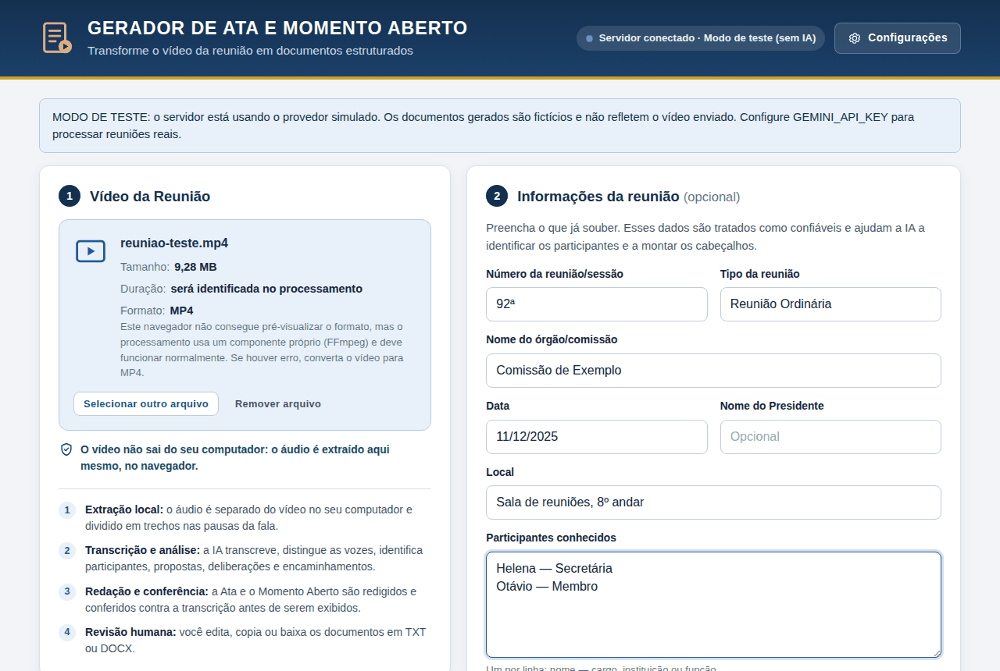
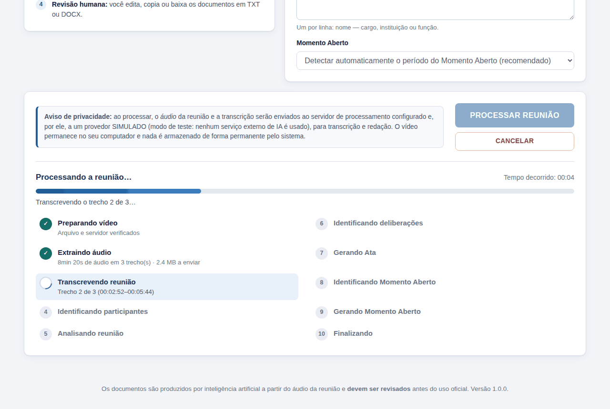
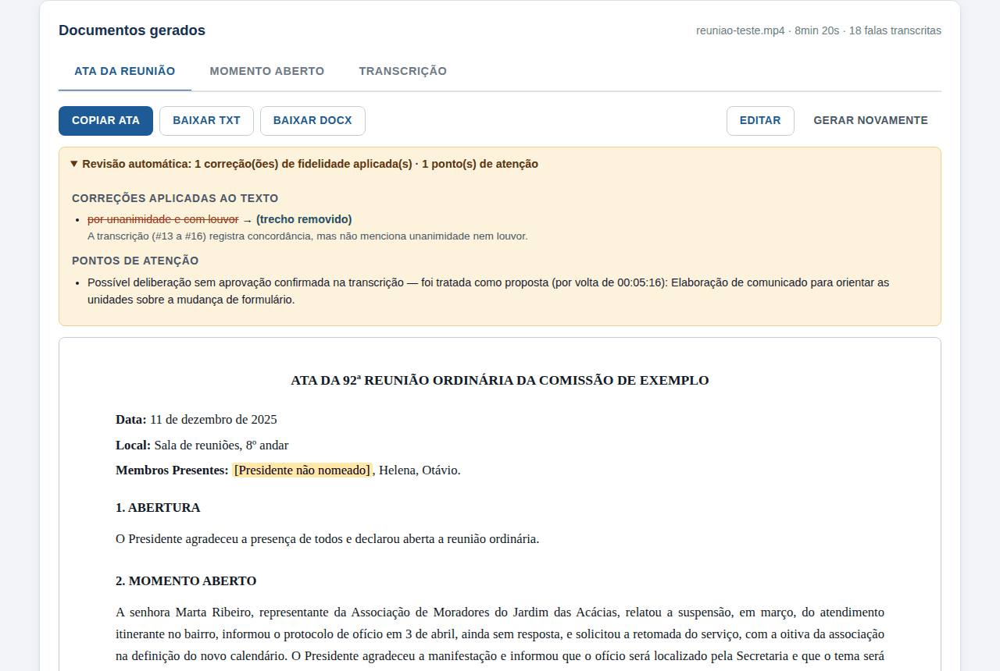
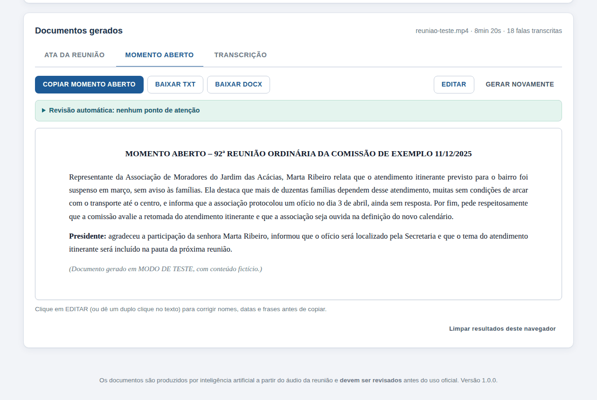
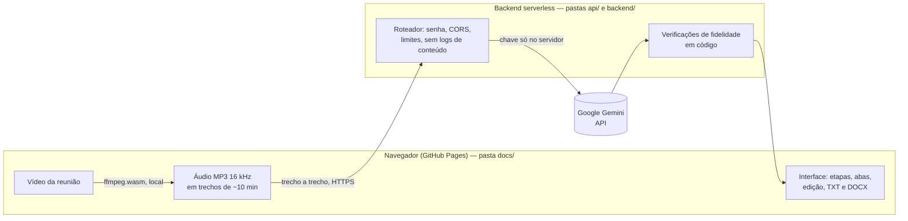
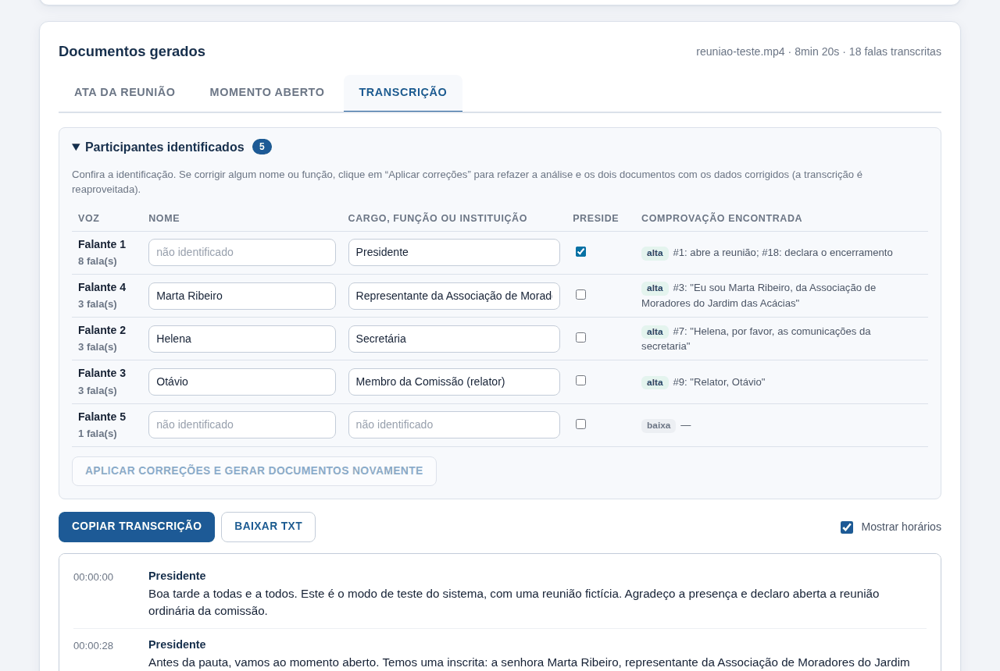

# Gerador de Ata e Momento Aberto

Aplicação web que transforma o **vídeo de uma reunião** em dois documentos independentes:

1. **ATA DA REUNIÃO** — formal e estruturada (seções numeradas, processos, `Deliberação:` em destaque);
2. **MOMENTO ABERTO** — relato institucional, narrativo e cronológico das manifestações (nunca em formato de roteiro).

A prioridade do sistema é, nesta ordem: **fidelidade ao que foi dito > qualidade da transcrição > identificação correta dos participantes > qualidade da redação > aparência**.



| Processamento em 10 etapas | Ata com revisão automática | Momento Aberto narrativo |
| --- | --- | --- |
|  |  |  |

> As capturas acima foram feitas no **modo de teste** (reunião fictícia, sem IA), que você também pode rodar em 1 minuto — veja [Execução local](#5-execução-local).

---

## Sumário

1. [Como funciona (arquitetura)](#1-como-funciona-arquitetura)
2. [Estrutura de pastas](#2-estrutura-de-pastas)
3. [Publicação passo a passo (GitHub + backend)](#3-publicação-passo-a-passo)
4. [Configuração da API e variáveis de ambiente](#4-configuração-da-api-e-variáveis-de-ambiente)
5. [Execução local](#5-execução-local)
6. [Como o vídeo é processado](#6-como-o-vídeo-é-processado)
7. [Como a IA identifica os participantes](#7-como-a-ia-identifica-os-participantes)
8. [Como a Ata é gerada](#8-como-a-ata-é-gerada)
9. [Como o Momento Aberto é gerado](#9-como-o-momento-aberto-é-gerado)
10. [Controle de qualidade e fidelidade](#10-controle-de-qualidade-e-fidelidade)
11. [Privacidade e segurança](#11-privacidade-e-segurança)
12. [Custos e limites](#12-custos-e-limites)
13. [Mensagens de erro](#13-mensagens-de-erro)
14. [Testes](#14-testes)
15. [Limitações conhecidas](#15-limitações-conhecidas)
16. [Melhorias futuras](#16-melhorias-futuras)
17. [Solução de problemas](#17-solução-de-problemas)
18. [Licenças de terceiros](#18-licenças-de-terceiros)

---

## 1. Como funciona (arquitetura)

O GitHub Pages hospeda apenas arquivos estáticos — ele **não consegue guardar uma chave de API em segredo**. Por isso o projeto tem duas partes:



| Parte | Onde roda | O que faz |
| --- | --- | --- |
| **Interface** (`docs/`) | GitHub Pages (ou qualquer hospedagem estática) | Recebe o vídeo, **extrai o áudio no próprio navegador**, mostra as etapas, exibe/edita/copia/baixa os documentos. HTML, CSS e JavaScript puros, sem etapa de build. |
| **Backend** (`api/`, `backend/`) | Vercel Functions (padrão), Cloudflare Workers ou Node.js | Guarda a chave da IA em **variável de ambiente**, exige senha de acesso, conversa com a IA, valida as respostas e aplica as verificações de fidelidade. **Sem dependências externas** (nenhum `npm install` é necessário). |
| **IA** | Google Gemini (API `generateContent`) | Transcreve o áudio distinguindo as vozes, analisa a reunião e redige os documentos. Uma única chave atende a tudo. |

**Por que o vídeo não é enviado?** Vídeos de reunião têm gigabytes; hospedagens gratuitas aceitam poucos megabytes por requisição (4,5 MB na Vercel). Extrair o áudio no navegador resolve o limite, acelera o processo (3 h de reunião viram ~55 MB de áudio) e melhora a privacidade: **o vídeo nunca sai do computador**.

---

## 2. Estrutura de pastas

```
gerador-ata-momento-aberto/
├── README.md                  ← este arquivo
├── .env.example               ← modelo das variáveis de ambiente (copie para .env no uso local)
├── .gitignore                 ← impede o envio de .env, vídeos e documentos ao GitHub
├── package.json               ← scripts (start, teste-local, test); sem dependências
├── vercel.json                ← Vercel: serve docs/ e publica api/ como funções
├── wrangler.toml              ← Cloudflare Workers (alternativa)
├── worker.js                  ← adaptador Cloudflare Workers
├── local-server.js            ← servidor local / Node (Render, Railway, VPS)
│
├── api/                       ← adaptadores Vercel (3 funções)
│   ├── health.js              ← GET  /api/health
│   ├── transcribe.js          ← POST /api/transcribe
│   └── task.js                ← POST /api/task
│
├── backend/                   ← lógica do servidor (APIs Web padrão; roda em qualquer plataforma)
│   ├── router.js              ← rotas, autenticação, CORS, limites, logs só de metadados
│   ├── config.js              ← leitura das variáveis de ambiente
│   ├── http.js                ← respostas JSON, CORS, senha (comparação em tempo constante)
│   ├── errors.js              ← códigos de erro padronizados
│   ├── prompts.js             ← PROMPTS INTERNOS + os dois modelos de referência
│   ├── schemas.js             ← esquemas JSON das respostas estruturadas
│   ├── tasks.js               ← as 8 tarefas de IA (transcrição, participantes, análise...)
│   ├── quality.js             ← VERIFICAÇÕES DE FIDELIDADE determinísticas
│   ├── transcript.js          ← formatação da transcrição e nomes de exibição
│   ├── json-utils.js          ← leitura tolerante de JSON produzido por IA
│   └── providers/
│       ├── index.js           ← seleção do provedor
│       ├── gemini.js          ← Google Gemini
│       └── mock.js            ← provedor simulado (teste sem chave e sem custo)
│
├── docs/                      ← INTERFACE (é esta pasta que o GitHub Pages publica)
│   ├── index.html
│   ├── config.js              ← configuração pública (endereço do backend). SEM segredos.
│   ├── favicon.svg
│   ├── .nojekyll
│   ├── css/styles.css
│   ├── js/
│   │   ├── app.js             ← ponto de entrada
│   │   ├── settings.js        ← preferências salvas no navegador
│   │   ├── lib/               ← dom.js, format.js, errors.js, docmodel.js
│   │   ├── services/          ← api.js, audio.js, pipeline.js, docx.js
│   │   └── ui/                ← upload.js, stepper.js, results.js, dialogs.js, toast.js
│   └── vendor/ffmpeg/         ← "controle remoto" do ffmpeg.wasm (MIT)
│
├── tests/                     ← testes automatizados (node --test)
└── documentacao/imagens/      ← capturas de tela usadas neste README
```

> A pasta da interface se chama `docs/` porque é o nome que o GitHub Pages aceita ao publicar a partir de uma pasta do repositório.

---

## 3. Publicação passo a passo

Você vai precisar de três contas gratuitas: **GitHub**, **Google AI Studio** (chave da IA) e **Vercel** (backend). Tempo estimado: 20 a 30 minutos.

### 3.1. Criar a chave da API (Google Gemini)

1. Acesse <https://aistudio.google.com/apikey> e entre com uma conta Google.
2. Clique em **Create API key** e copie a chave. **Guarde-a como uma senha** — ela só será colada no painel do backend, nunca no código.
3. Para reuniões confidenciais, **ative o faturamento** do projeto (camada paga). Veja o motivo em [Privacidade](#11-privacidade-e-segurança) e os valores em [Custos](#12-custos-e-limites).

### 3.2. Criar o repositório no GitHub e enviar os arquivos

**Pelo site (sem instalar nada):**

1. Em <https://github.com/new>, dê um nome (ex.: `gerador-ata`), marque **Public** e clique em **Create repository**.
   > No plano gratuito do GitHub, o Pages só funciona em repositório público. Não há problema: **o código não contém nenhum segredo**.
2. Na página do repositório, clique em **uploading an existing file**.
3. Descompacte o projeto no computador, **abra a pasta** `gerador-ata-momento-aberto`, selecione **todo o conteúdo dela** e arraste para a página do GitHub (as subpastas são preservadas).
4. Clique em **Commit changes**.
5. Confira se os arquivos iniciados por ponto foram enviados (`.gitignore`, `.env.example`, `docs/.nojekyll`). Alguns sistemas os ocultam; se faltarem, crie-os em **Add file → Create new file**, colando o conteúdo. (Nenhum deles é indispensável para o sistema funcionar.)

**Pelo Git (para quem já usa):**

```bash
cd gerador-ata-momento-aberto
git init && git add . && git commit -m "Gerador de Ata e Momento Aberto"
git branch -M main
git remote add origin https://github.com/SEU-USUARIO/gerador-ata.git
git push -u origin main
```

### 3.3. Publicar o backend na Vercel

1. Acesse <https://vercel.com>, entre com a conta do GitHub e clique em **Add New… → Project**.
2. Em **Import Git Repository**, escolha o repositório criado.
3. Em **Framework Preset**, deixe **Other**. Não altere comandos de build (o arquivo `vercel.json` já cuida disso).
4. Abra **Environment Variables** e cadastre:

   | Nome | Valor |
   | --- | --- |
   | `GEMINI_API_KEY` | a chave criada no passo 3.1 |
   | `ACCESS_PASSWORD` | uma senha longa, que você informará às pessoas autorizadas |
   | `ALLOWED_ORIGINS` | `https://SEU-USUARIO.github.io` (somente a origem — **sem** o nome do repositório e **sem** barra no final) |

5. Clique em **Deploy**. Ao terminar, anote o endereço do projeto, por exemplo `https://gerador-ata.vercel.app`.
6. Teste: abra `https://gerador-ata.vercel.app/api/health`. Deve aparecer um JSON com `"configured": true`.

> **Atenção ao plano da Vercel:** o plano gratuito (*Hobby*) é restrito, pelos termos da própria Vercel, a **uso pessoal e não comercial**. Para uso institucional, avalie o plano Pro ou use a alternativa gratuita **Cloudflare Workers** (seção 3.7).

> Ao alterar variáveis de ambiente depois, é preciso publicar de novo: **Deployments → ⋯ → Redeploy**.

### 3.4. Apontar a interface para o backend

No GitHub, abra `docs/config.js`, clique no lápis (**Edit**) e preencha o endereço da Vercel:

```js
API_BASE_URL: "https://gerador-ata.vercel.app",
```

Clique em **Commit changes**. (Quem preferir pode deixar em branco e informar o endereço depois, na tela, em **Configurações** — mas aí cada pessoa teria de fazê-lo no próprio navegador.)

### 3.5. Ativar o GitHub Pages

1. No repositório: **Settings → Pages**.
2. Em **Build and deployment → Source**, escolha **Deploy from a branch**.
3. Em **Branch**, selecione `main` e a pasta **`/docs`**. Clique em **Save**.
4. Aguarde de 1 a 3 minutos. O endereço aparece no topo da página: `https://SEU-USUARIO.github.io/gerador-ata/`.

### 3.6. Acessar a aplicação

1. Abra `https://SEU-USUARIO.github.io/gerador-ata/`.
2. No canto superior direito deve aparecer **“Servidor conectado · Google Gemini”**.
3. Selecione o vídeo, preencha o que souber e clique em **PROCESSAR REUNIÃO**. Na primeira vez, o sistema pede a **senha de acesso** (a `ACCESS_PASSWORD`).

> A Vercel também publica a interface no próprio endereço dela (`https://gerador-ata.vercel.app`). É um segundo endereço funcional, que dispensa qualquer configuração de `API_BASE_URL`.

### 3.7. Alternativa: backend no Cloudflare Workers

O plano gratuito do Workers não tem a restrição de uso não comercial e aceita requisições de até 100 MB.

```bash
npm install -g wrangler          # ou use: npx wrangler ...
wrangler login
wrangler secret put GEMINI_API_KEY
wrangler secret put ACCESS_PASSWORD
wrangler deploy
```

Depois, no painel do Worker (**Settings → Variables and Secrets**), defina `ALLOWED_ORIGINS` com a origem do GitHub Pages e use o endereço `https://gerador-ata-momento-aberto.SEU-SUBDOMINIO.workers.dev` em `docs/config.js`. O Worker também serve a interface (pasta `docs/`) no próprio endereço.

> O plano gratuito do Workers limita o **tempo de CPU** a 10 ms por requisição (o tempo de espera pela IA não conta). O backend foi escrito para gastar o mínimo de CPU, mas, se os logs do Cloudflare mostrarem “exceeded CPU time limit”, reduza a duração dos trechos em **Configurações → Opções avançadas** (ex.: 5 min) ou use o plano pago (US$ 5/mês).

### 3.8. Alternativa: servidor Node próprio (Render, Railway, VPS, intranet)

Qualquer máquina com Node.js 20+ serve: `npm start` sobe interface e API juntas na porta definida em `PORT`. Defina as mesmas variáveis de ambiente. Nesse cenário `MAX_AUDIO_MB` pode subir (ex.: `12`).

---

## 4. Configuração da API e variáveis de ambiente

Todas ficam **somente no servidor** (painel da Vercel/Cloudflare ou arquivo `.env` local). O modelo comentado está em [`.env.example`](.env.example).

| Variável | Obrigatória | Padrão | Descrição |
| --- | --- | --- | --- |
| `GEMINI_API_KEY` | **sim** | — | Chave do Google Gemini. |
| `ACCESS_PASSWORD` | recomendada | vazio | Senha exigida pela interface. Sem ela, quem descobrir o endereço do servidor pode gastar a sua cota. |
| `ALLOWED_ORIGINS` | recomendada | qualquer origem | Origens autorizadas (CORS), separadas por vírgula. Ex.: `https://usuario.github.io`. |
| `GEMINI_MODEL` | não | `gemini-flash-latest` | Modelo usado para transcrever e redigir. O apelido *latest* acompanha o Flash mais recente, evitando que o sistema quebre quando um modelo for aposentado. |
| `GEMINI_TRANSCRIPTION_MODEL` / `GEMINI_TEXT_MODEL` | não | = `GEMINI_MODEL` | Modelos distintos para transcrição e redação. |
| `GEMINI_FALLBACK_MODELS` | não | `gemini-3.8-flash,gemini-3.5-flash-lite,gemini-2.5-flash` | Tentados em ordem se o principal não existir ou não estiver na sua cota. |
| `GEMINI_THINKING_LEVEL` | não | padrão do modelo | `low`, `medium` ou `high` (modelos Gemini 3). |
| `GEMINI_TEMPERATURE` | não | padrão do modelo | 0 a 2. Nos modelos Gemini 3, o Google recomenda manter o padrão. |
| `MAX_AUDIO_MB` | não | `4` | Tamanho máximo de cada trecho de áudio. A interface ajusta a duração dos trechos a esse limite. Na Vercel, mantenha 4. |
| `REQUEST_BUDGET_SECONDS` | não | `280` | Tempo máximo de espera pela IA por requisição (a Vercel encerra funções aos 300 s). |
| `AI_PROVIDER` | não | `gemini` | `local` roda tudo no próprio computador (whisper.cpp + Ollama — veja [`instalacao-local/LEIA-ME.md`](instalacao-local/LEIA-ME.md)); `mock` liga o provedor simulado (teste sem chave). |
| `PORT` | não | `3000` | Porta do servidor local. |

**Segurança da chave:** o navegador nunca recebe a chave. Ela é lida em `backend/config.js` e enviada ao Google apenas no cabeçalho `x-goog-api-key` (nunca em URL, log ou resposta). `docs/config.js` é público e contém só o endereço do backend.

---

## 5. Execução local

Requisito: [Node.js 20 ou superior](https://nodejs.org). Não há dependências para instalar.

**Modo de teste (sem chave, sem custo)** — valida a instalação e mostra todo o fluxo com uma reunião fictícia:

```bash
npm run teste-local
# abra http://localhost:3000
```

**Com a IA de verdade:**

```bash
cp .env.example .env        # no Windows: copy .env.example .env
# edite .env e preencha GEMINI_API_KEY
npm start
# abra http://localhost:3000
```

> Não abra `docs/index.html` com duplo clique: navegadores bloqueiam módulos JavaScript em `file://`. Use sempre o servidor local.

**Modo 100% local (sem serviço de IA, sem cota e sem custo):** a transcrição pode ser feita pelo **whisper.cpp** e a redação pelo **Ollama**, tudo no seu computador — nenhum dado sai dele. No Windows, dê um duplo clique em `instalacao-local/instalar.cmd` e depois em `iniciar-local.cmd`. Leia antes as limitações (velocidade e ausência de separação de vozes) em [`instalacao-local/LEIA-ME.md`](instalacao-local/LEIA-ME.md).

---

## 6. Como o vídeo é processado

As dez etapas exibidas na tela correspondem a operações reais:

| # | Etapa | O que acontece | Onde |
| --- | --- | --- | --- |
| 1 | Preparando vídeo | Valida o arquivo, confere servidor e **senha antes do trabalho pesado**, baixa o ffmpeg.wasm (só na 1ª vez; integridade conferida por SHA-256). | navegador |
| 2 | Extraindo áudio | O vídeo é lido direto do disco (sem carregá-lo na memória — testado com arquivo de 2,5 GB), convertido para MP3 mono 16 kHz e **cortado nas pausas da fala** em trechos de ~10 min. | navegador |
| 3 | Transcrevendo reunião | Cada trecho é transcrito com identificação de vozes. O trecho seguinte recebe o **catálogo de vozes** e as últimas falas do anterior, para manter os mesmos rótulos. Números, siglas e nomes incertos saem marcados com `[?]`; trechos incompreensíveis, com `[inaudível]`. | backend + IA |
| 4 | Identificando participantes | Liga cada voz a nome/cargo **somente com comprovação** (ver seção 7). | backend + IA |
| 5 | Analisando reunião | Mapa estruturado: dados gerais, Presidência, pauta real, processos, datas, normas, pontos incertos, encerramento. | backend + IA |
| 6 | Identificando deliberações | Classifica propostas, deliberações e encaminhamentos **com citação literal conferida em código** (ver seção 10). | backend + IA + código |
| 7 | Gerando Ata | Redação no padrão do modelo de Ata. | backend + IA |
| 8 | Identificando Momento Aberto | Localiza o período (anúncio da Presidência, chamada de inscritos). Se não existir, usa a reunião inteira e avisa. | backend + IA |
| 9 | Gerando Momento Aberto | Redação narrativa; o formato é validado em código e **refeito automaticamente** se sair como roteiro. | backend + IA + código |
| 10 | Finalizando | Revisão de fidelidade dos dois documentos + conferências determinísticas + liberação de memória. | backend + IA + código |

**Resiliência:** limite de uso da IA → espera o tempo indicado, com contagem na tela, e continua; falha passageira → repete sozinho; erro persistente → **TENTAR NOVAMENTE** retoma do ponto em que parou (trechos já transcritos **não** são refeitos nem cobrados de novo); trecho que a IA não consegue transcrever inteiro (saída cortada, laço de repetição, bloqueio) → é dividido ao meio e reenviado.

**Reprocessar:** *PROCESSAR NOVAMENTE* oferece refazer tudo ou só análise e documentos; *GERAR NOVAMENTE* (em cada aba) refaz um único documento, aceita orientações adicionais e **preserva as edições feitas no outro**.

---

## 7. Como a IA identifica os participantes

Combina, como pedido: (1) dados informados pelo usuário; (2) identificação de voz feita na transcrição; (3) nomes mencionados; (4) cargos e funções mencionados; (5) contexto; (6) conteúdo das falas.

Regras codificadas no prompt (`backend/prompts.js → participantsPrompt`) e no código:

- Um **nome** só é atribuído com comprovação: a pessoa se apresenta; é chamada e responde; é anunciada ao receber a palavra; ou consta da lista do usuário **e** a transcrição confirma de quem se trata. Nada de atribuição “por eliminação”.
- Quem abre, concede a palavra, coloca em deliberação e encerra **preside**. Se o usuário informou o nome do Presidente, ele é ligado a essa voz.
- Cada identificação traz **comprovação** (com o nº do segmento) e **confiança** (alta/média/baixa), exibidas na aba *Transcrição*.
- Hierarquia de exibição, sempre com a informação mais precisa comprovável: **nome → função** (“Membro da Comissão”) **→ instituição** (“Representante da …”) **→ “Participante não identificado”**.
- Na aba *Transcrição* o usuário pode **corrigir nomes e funções** e clicar em *Aplicar correções*: análise e documentos são refeitos com a identificação corrigida, reaproveitando a transcrição.
- Os rótulos de voz podem errar; por isso os prompts de redação mandam prevalecer o contexto (vocativos, apresentações) e, na dúvida, usar designação genérica.



---

## 8. Como a Ata é gerada

Prompt em `backend/prompts.js → ataPrompt`. Ele contém a instrução interna solicitada (seção 41 da especificação), o **modelo de Ata** como referência de estilo e as regras:

- **Cabeçalho:** `ATA DA [número]ª [TIPO] DA/DO [ÓRGÃO]`, `Data:` por extenso, `Local:`, `Membros Presentes (Presencial)/(Remoto)` — ou uma única linha `Membros Presentes:` quando a modalidade não for comprovável. Dado desconhecido é **omitido**; Presidente sem nome vira `[Presidente não nomeado]`.
- **Seções numeradas adaptadas à reunião real**; seção sem conteúdo não é criada.
- **Processos:** `5.1. Processo [número] – [assunto] (Relator: [nome])`, registrando manifestação do relator, informações, histórico, proposta, deliberação e encaminhamento. Número pouco audível → `[informação não identificada no áudio]`.
- **`Deliberação:`** só é escrita para itens **confirmados** na etapa 6. Propostas são narradas como propostas. Encaminhamentos vão em texto corrido, com responsável e prazo.
- **Encerramento:** a fórmula “Não havendo mais assuntos a serem tratados…” só aparece se a transcrição indicar o encerramento.
- Linguagem formal, terceira pessoa, pretérito; corrige a fala sem mudar o sentido; sem opiniões; texto puro (sem Markdown).

Entram no prompt: dados do usuário (confiáveis), dados ditos na reunião, participantes, mapa da reunião, itens verificados, orientações adicionais (se houver) e a transcrição completa.

---

## 9. Como o Momento Aberto é gerado

Prompt em `backend/prompts.js → momentoPrompt`, com a instrução interna da seção 42 e o **modelo de Momento Aberto** como referência:

- **Cabeçalho:** `MOMENTO ABERTO – [número]ª [SESSÃO/REUNIÃO tipo] DO/DA [ÓRGÃO] [dd/mm/aaaa]`.
- **Um parágrafo de texto corrido por manifestação**, em ordem cronológica, iniciado por `[Função/representação], [Nome]` e verbo no presente (“homenageia…”, “expressa preocupação…”, “pede respeitosamente…”).
- **Presidência em parágrafo próprio**, iniciado exatamente por `Presidente:` + verbo no pretérito, registrando o **conteúdo** da resposta (nunca só “Agradeceu.”).
- **Proibido:** `[Presidente]`, `Nome: fala`, marcadores, diálogo, transcrição literal, resumos telegráficos.
- **Detalhamento:** quem falou, por quê, assunto, argumentos, informações, pedido, preocupação e resposta da Presidência.

**Garantia em código (`backend/quality.js → validateMomentoFormat`):** o texto gerado é inspecionado; se houver linha entre colchetes, padrão `Nome: fala`, marcador de lista ou resposta telegráfica da Presidência — ou se o relato tiver menos de 6% do tamanho das falas —, o backend **manda refazer** com a lista de problemas. Persistindo, o problema aparece em *Pontos de atenção*.

---

## 10. Controle de qualidade e fidelidade

Além dos prompts, há verificações **determinísticas** (`backend/quality.js`), porque regra crítica não pode depender só da boa vontade do modelo:

| Verificação | Como funciona |
| --- | --- |
| **Sugestão não vira decisão** | Toda deliberação precisa vir com uma **citação literal** que comprove a aprovação. O código procura a citação na transcrição (tolerando pontuação e acentos). **Se não achar, rebaixa para proposta** — e a Ata não recebe `Deliberação:`. O caso aparece em *Pontos de atenção* com o horário para conferência no vídeo. |
| **Contagem de deliberações** | Se a Ata tiver mais linhas `Deliberação:` do que deliberações confirmadas, gera alerta. |
| **Revisão de fidelidade por IA** | Um “revisor” compara cada afirmação com a transcrição (nomes, datas, números, cargos, relatores, decisões, responsáveis, prazos). Correções são aplicadas **somente** quando o trecho é localizado de forma inequívoca, e todas ficam visíveis (antes → depois + motivo). |
| **Números** | Todo número do documento é procurado na transcrição e nos dados do usuário — inclusive por extenso (“vinte e nove” = 29; “nongentésima sexta” = 906; dígitos ditados um a um). |
| **Nomes** | Palavras com inicial maiúscula no meio das frases (nomes de pessoas e instituições) que não existam nas fontes são listadas para conferência. |
| **Formato do Momento Aberto** | Ver seção 9. |
| **Marcas de incerteza** | `[?]`, `[inaudível]` e `[informação não identificada no áudio]` ficam **realçadas em amarelo** na tela e no DOCX. |
| **Defeitos de transcrição** | Laço de repetição e saída cortada são detectados; o trecho é dividido e refeito. |

Os modelos de referência são usados **apenas como estilo**: os prompts proíbem reaproveitar qualquer nome, data, número ou fato deles.

---

## 11. Privacidade e segurança

- **O vídeo não sai do computador.** Só o áudio comprimido é enviado, por HTTPS, em trechos.
- **Nada é gravado pelo sistema.** O backend processa em memória. O áudio segue embutido na requisição (não usa a *Files API* do Google) e as chamadas levam `store: false`. Os arquivos temporários do ffmpeg vivem na memória do navegador e são liberados ao fim de cada etapa.
- **Logs sem conteúdo:** o backend registra apenas metadados (rota, tarefa, status, duração, tamanho).
- **Transcrições não ficam públicas:** os resultados ficam no `sessionStorage` da aba (somem ao fechá-la) e podem ser apagados em *Limpar resultados deste navegador*.
- **Aviso ao usuário:** a tela informa, antes do processamento, que o áudio e a transcrição vão para o servidor e para o serviço externo de IA.
- **Camada gratuita × paga do Gemini:** segundo a página de preços do Google, na camada gratuita o conteúdo **é usado para melhorar os produtos**; na paga, **não**. Para reuniões sigilosas, ative o faturamento e leia os [termos da API](https://ai.google.dev/gemini-api/terms).
- **Proteção do backend:** senha (`ACCESS_PASSWORD`, comparação em tempo constante e atraso contra força bruta), CORS restrito (`ALLOWED_ORIGINS`), limites de tamanho e validação de toda entrada.
- **Proteção da interface:** *Content-Security-Policy* restritiva; todo texto vindo da IA entra na página como texto (nunca como HTML); o núcleo do ffmpeg tem integridade conferida por SHA-256.
- A senha só fica salva no navegador se o usuário marcar “Lembrar”.

---

## 12. Custos e limites

- **GitHub Pages:** gratuito. **Vercel Hobby / Cloudflare Workers Free:** gratuitos, dentro dos limites de cada um.
- **Gemini — camada gratuita:** existe, mas os limites por minuto e por dia variam por projeto (consulte <https://aistudio.google.com/rate-limit>). Uma reunião de 3 h consome cerca de 18 requisições de transcrição + 7 de análise e redação; é comum esbarrar no limite — o sistema espera e continua sozinho, mas pode demorar.
- **Gemini — camada paga (estimativa, set/2026):** o áudio consome 32 tokens por segundo (≈ 115 mil tokens por hora). Uma reunião de **3 horas** custa aproximadamente **US$ 0,50 (Flash-Lite) a US$ 1,10 (Flash)**, podendo dobrar com os reajustes anunciados para 2027. Valores oficiais: <https://ai.google.dev/gemini-api/docs/pricing>.
- **Tamanhos:** vídeo de até 8 GB por padrão (`MAX_FILE_SIZE_GB` em `docs/config.js`); 3 h de reunião viram ~55 MB de áudio.
- **Tempo:** extrair o áudio leva de segundos a poucos minutos; a transcrição leva de 5 a 15 min por hora de reunião.

---

## 13. Mensagens de erro

Todas em português, com orientação e “Detalhes técnicos” recolhidos (`docs/js/lib/errors.js`):

| Situação | Mensagem |
| --- | --- |
| Arquivo inválido / formato não suportado | “Formato não suportado. Use MP4, MOV, WEBM, AVI ou MKV…” |
| Arquivo muito grande | “Arquivo muito grande.” + como reduzir |
| Vídeo sem faixa de áudio | “O vídeo não possui faixa de áudio.” |
| Áudio mudo / sem fala | “O áudio do vídeo está mudo…” / “Nenhuma fala foi identificada…” |
| Áudio de baixa qualidade | aviso: “revise os documentos com atenção redobrada” |
| Arquivo corrompido / erro de processamento | “Não foi possível processar o vídeo. Verifique o arquivo e tente novamente.” |
| Erro de upload / trecho grande demais | “Erro ao enviar o áudio…” / “O trecho de áudio excede o limite…” |
| Falha de conexão / tempo limite | “Falha de conexão com o servidor.” / “O processamento excedeu o tempo limite.” |
| Erro de transcrição / erro da API | “Erro na transcrição do áudio.” / “Erro da API de IA.” |
| Limite de uso / cota esgotada | espera automática com contagem / orientação sobre faturamento |
| Servidor não configurado / senha | orientação para *Configurações* / pedido de senha |

---

## 14. Testes

```bash
npm test
```

São 30 testes (executor nativo do Node, sem dependências): leitura tolerante de JSON; **rebaixamento de deliberação sem comprovação**; validação do formato do Momento Aberto (o modelo de referência passa; roteiro é reprovado); números por extenso; conferência de números e nomes; aplicação rastreável das correções; autenticação e CORS; limites de entrada; fluxo completo com o provedor simulado; e o provedor Gemini com rede simulada (chave só no cabeçalho, `store: false`, troca automática de modelo, mapeamento de erros).

O fluxo de ponta a ponta também foi exercitado em navegador real (Chromium): envio, extração de áudio (MP4, MOV, WEBM, AVI, MKV, MP3 e arquivo de 2,5 GB), as 10 etapas, senha, limite de uso, divisão de trecho, queda de conexão com retomada, cancelamento, edição, cópia, TXT, DOCX, correção de participantes, nova geração e telas de celular e tablet.

---

## 15. Limitações conhecidas

1. **A revisão humana é indispensável.** Transcrição automática erra — sobretudo nomes próprios, siglas e números em áudio ruim. O sistema reduz e sinaliza o risco, mas não o elimina.
2. **Identificação de vozes é aproximada.** Vozes parecidas, falas sobrepostas e microfone distante causam trocas; entre um trecho e outro a continuidade dos rótulos pode falhar. A identificação por **contexto** e a correção manual na aba *Transcrição* compensam isso.
3. **A integração com o Gemini não pôde ser exercitada com uma chave real no ambiente em que o projeto foi construído.** Ela segue a documentação oficial vigente e é coberta por testes com rede simulada; ainda assim, faça um primeiro teste com uma reunião curta.
4. **Depende de serviços externos:** Google Gemini (modelos e preços mudam; há lista de modelos alternativos) e, na primeira utilização, a CDN do ffmpeg.wasm (~31 MB). Redes muito restritas podem bloquear a CDN — veja *Solução de problemas*.
5. **Celular:** a interface é responsiva, mas extrair áudio de vídeos grandes exige memória; prefira o computador.
6. **Plano gratuito da Vercel:** uso pessoal/não comercial e 4,5 MB por requisição (já tratado pelos trechos).
7. **Reuniões muito longas (5 h ou mais)** funcionam, porém levam tempo e podem esbarrar nos limites da camada gratuita.
8. **Momento Aberto inexistente:** se a gravação não tiver esse período, o relato cobre a reunião inteira (com aviso).
9. **Horários aproximados:** as marcações de tempo da transcrição podem variar alguns segundos.
10. O DOCX tem formatação sóbria (Times New Roman 12, margens 3/2 cm, A4), sem timbre nem cabeçalho institucional.

---

## 16. Melhorias futuras

- Provedor alternativo de transcrição dedicada (ex.: `gemini-3.5-transcribe`, AssemblyAI, Deepgram) com diarização acústica global — a arquitetura de provedores (`backend/providers/`) já comporta.
- Cadastro de **vozes conhecidas** (amostras dos membros) para reconhecimento entre reuniões.
- Clicar em um horário da transcrição e ouvir o trecho correspondente.
- Modelos de documento por órgão (timbre, cabeçalho, rodapé, campos de assinatura) e exportação em PDF/ODT.
- Glossário por órgão (nomes, siglas, atos normativos) injetado na transcrição.
- Processamento a partir de link (YouTube/Drive) em backend com fila.
- Histórico criptografado de reuniões e edição colaborativa.
- Login institucional (SSO) em vez de senha única.
- Exibição em tempo real do texto sendo redigido.

---

## 17. Solução de problemas

| Sintoma | Causa provável e solução |
| --- | --- |
| “Servidor não conectado” | `API_BASE_URL` vazio ou errado em `docs/config.js`; backend não publicado; `ALLOWED_ORIGINS` diferente da origem do site (use `https://usuario.github.io`, sem caminho). Teste `…/api/health` no navegador. |
| “Servidor sem chave de IA” | Falta `GEMINI_API_KEY` no backend — cadastre e publique de novo (*Redeploy*). |
| “A chave de API… foi recusada” | Chave incorreta, revogada ou restrita. Gere outra no AI Studio. |
| “O modelo de IA configurado não está disponível” | Ajuste `GEMINI_MODEL` para um modelo vigente (<https://ai.google.dev/gemini-api/docs/models>). |
| “Limite de uso…” repetidamente | Camada gratuita. Aguarde, ou ative o faturamento. |
| “Não foi possível carregar o componente de extração de áudio” | A rede bloqueia a CDN. Hospede o núcleo você mesmo: copie `ffmpeg-core.js` e `ffmpeg-core.wasm` do pacote npm `@ffmpeg/core@0.12.10` (pasta `dist/umd`) para `docs/vendor/ffmpeg-core/`, envie **pelo Git** (o site do GitHub só aceita até 25 MB por arquivo) e ponha `"vendor/ffmpeg-core"` no início de `FFMPEG_CORE_SOURCES` em `docs/config.js`. |
| “O processamento excedeu o tempo limite” | Trechos longos demais para o momento do serviço. Reduza a duração dos trechos em *Configurações* e clique em *TENTAR NOVAMENTE*. |
| Erro 504 na Vercel logo aos 10–60 s | *Fluid compute* desativado no projeto. Ative em **Settings → Functions**. |
| Página do GitHub Pages dá 404 | Pages ainda publicando (aguarde alguns minutos) ou pasta errada — deve ser **`/docs`**. |
| Acentos estranhos no TXT | Abra como UTF-8 (o arquivo já leva a marca BOM para facilitar). |

---

## 18. Licenças de terceiros

- `docs/vendor/ffmpeg/ffmpeg.js` e `814.ffmpeg.js`: [ffmpeg.wasm](https://github.com/ffmpegwasm/ffmpeg.wasm) (`@ffmpeg/ffmpeg` 0.12.15), licença **MIT** — aviso em `docs/vendor/ffmpeg/LEIA-ME.txt`.
- O núcleo `@ffmpeg/core` 0.12.10 (FFmpeg em WebAssembly, **GPL-2.0-or-later**) **não é distribuído** neste repositório: o navegador o baixa da CDN em tempo de execução.
- Não há outras dependências: backend e interface usam apenas recursos nativos do Node.js e do navegador.
